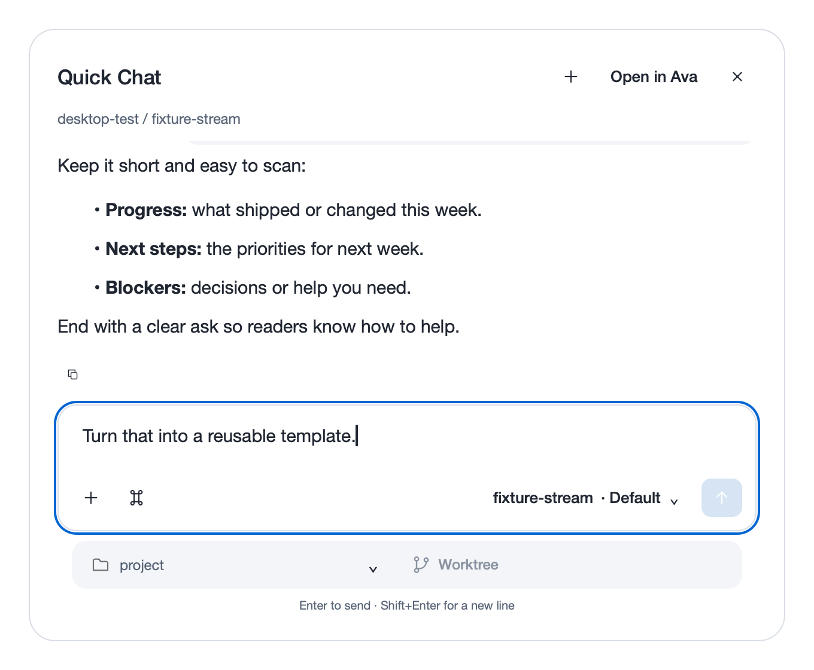

<p align="center">
  
</p>

<p align="center">
  <strong>A general-purpose AI agent for research, writing, analysis, automation, and code.</strong>
</p>

<p align="center">
  <a href="https://github.com/SmartAI/ava/actions/workflows/ci.yml"></a>
  
  <a href="LICENSE"></a>
  
</p>

**Give Ava a task, not just a question.** Work with files, a browser, and connected
tools to turn a goal into a deliverable you can review. Start with a folder—it
doesn't have to be a code repository.

## News

- **2026-09-10 · [v0.1.0](https://github.com/SmartAI/ava/releases/tag/v0.1.0) — First alpha:** A native desktop workbench for research, writing, analysis, automation, and coding, with browser tools, file previews, SSH sessions, skills, and MCP.
- **2026-09-09 · Benchmark:** Ava solved 11/22 tasks in a SWE-bench Pro coding pilot, compared with Pi’s 10/22—a small-sample result, not a general-purpose benchmark.

## Meet Ava


## What can Ava do?

- **[Research and write](docs/features.md#research-and-writing)** — comparisons, briefs, proposals, and organized notes.
- **[Analyze data](docs/features.md#data-analysis)** — explore datasets and turn findings into reports.
- **[Work on the web](docs/features.md#browser-handoff)** — inspect pages, fill forms, and hand control back.
- **[Automate routines](docs/features.md#automations-and-background-work)** — schedule prompts and return to the results.
- **[Build software](docs/features.md#git-and-terminals)** — edit code, run tests, and review changes.

## Feature highlights

- **[Quick Chat](docs/features.md#quick-chat)** — press **⌘⌥Space** on macOS to start a task from any app, then continue in the workbench.
- **[Desktop workbench](docs/features.md#desktop-workbench)** — conversations, file and image attachments, Markdown, and multi-page PDF previews together.
- **[Browser handoff](docs/features.md#browser-handoff)** — share a visible tab with Ava to navigate and fill forms; take control back at any time.
- **[Skills and MCP](docs/features.md#skills-and-mcp)** — reuse project instructions and connect external tools.
- **[Automations](docs/features.md#automations-and-background-work)** — schedule recurring tasks and review each run as a conversation.
- **[Sessions and SSH](docs/features.md#sessions-and-remote-machines)** — search and resume conversations; keep remote projects and execution on their machine.
- **[Session board and analytics](docs/features.md#session-board-and-analytics)** — organize work by review status and inspect token and activity trends.
- **[Git and terminals](docs/features.md#git-and-terminals)** — run interactive shells, review and stage diffs, commit changes, and work in isolated worktrees.
- **[Models and providers](docs/features.md#models-and-providers)** — choose Anthropic, OpenAI, DeepSeek, Codex, or custom endpoints per conversation.
- **[Context and activity](docs/features.md#context-and-activity)** — inspect tool calls and estimated context usage, with automatic compaction for long conversations.
- **[Multiple interfaces](docs/features.md#interfaces)** — native desktop, Web UI, CLI, and Python API.

[](docs/features.md#quick-chat)

Interested in the full feature set? [Review the feature guide and screenshot tour →](docs/features.md)

<p align="center">
  <a href="docs/features.md"></a>
</p>

## Quick start

Requires **Python 3.12+**, [uv](https://docs.astral.sh/uv/), and **macOS or Linux**.

```sh
git clone https://github.com/SmartAI/ava.git
cd ava
uv sync --extra desktop
uv run --extra desktop ava-desktop --project .
```

Configure a provider in **Settings → Providers**, choose a folder, and start a
conversation. [Web UI, CLI, Python, and full setup instructions](docs/usage.md).

**Alpha software:** tools run with your account's permissions, without a sandbox
or per-call approval. Review consequential actions.
[Permissions and privacy](docs/features.md#permissions-and-privacy).

## Benchmark

In a **22-task SWE-bench Pro coding pilot**, Ava solved **11/22 tasks**; Pi solved
10/22. This is a small coding-only comparison, not a general-purpose benchmark.
[Results, methodology, and limitations](docs/benchmark.md).

## Documentation

- [Features and screenshots](docs/features.md)
- [Usage and configuration](docs/usage.md)
- [Goal mode (experimental)](docs/goals.md)
- [Architecture and system diagram](docs/architecture.md)
- [Desktop design system](docs/desktop-design-system.md)
- [Evaluation guide](eval/README.md)

## License

[MIT](LICENSE) © 2026 Min Liu.
