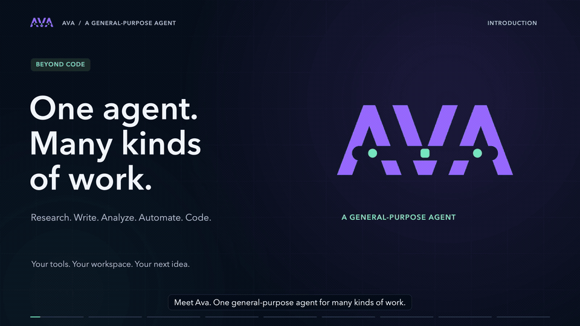

<p align="center">
  
</p>

<p align="center">
  <strong>A general-purpose AI agent for research, writing, analysis, automation, and code.</strong>
</p>

<p align="center">
  <a href="https://github.com/SmartAI/ava/actions/workflows/ci.yml"></a>
  
  <a href="LICENSE"></a>
  
</p>

**Give Ava a task, not just a question.** It can work with your files, operate a
browser you hand over, run commands, and use connected tools to produce something
you can review: a research brief, a cleaned dataset, a document, or a code change.
Reusable skills teach it your workflows; scheduled prompts handle recurring work.

Use the native desktop workbench, the local Web UI, or the CLI. Underneath is the
same Python runtime with durable sessions, inspectable tool activity, and support
for multiple model providers. Coding is one powerful use case—not the boundary.

[Watch the introduction](#meet-ava) · [What can Ava do?](#what-can-ava-do) ·
[Highlights](#highlights) · [Quick start](#quick-start) · [Documentation](#documentation)

## Meet Ava



## What can Ava do?

Start with a folder and a goal. A project can be a research workspace, a collection
of notes, or a data directory—it does not have to be a Git repository.

| Task | Example request | What Ava can work with |
| --- | --- | --- |
| **Research and compare** | “Compare these suppliers and write a brief with sources and open questions.” | Local source material, a shared desktop browser tab, and connected research tools. |
| **Write and organize** | “Turn these meeting notes into a project proposal and an action list.” | Text files, Markdown, reusable writing skills, and file-editing tools. |
| **Analyze data** | “Check these CSV exports for inconsistencies and save a summary of the trends.” | Files, shell commands, and analysis tools installed on the execution machine. |
| **Work on the web** | “Read this page and fill in the draft form. Leave submission to me.” | Explicit browser handoff, page inspection, navigation, clicks, text input, and screenshots. |
| **Automate recurring work** | “Every Monday, summarize the new reports in this folder.” | Scheduled prompts, a chosen machine and project, and a separate conversation for each run. |
| **Build and maintain software** | “Fix this bug, add regression tests, and explain the diff.” | Code editing, terminals, Git worktrees, change review, and test commands. |

These are starting points, not built-in specialist services or guarantees of
success. Results depend on the model, available tools, permissions, and source
material. Web access comes through the desktop browser or tools you configure;
document conversion and specialized analysis may require additional programs.

## Highlights

### Your files, browser, and tools in one workspace

- **Native desktop workbench.** Keep conversations, files, browser tabs, and
  interactive terminals together. Resizable sidebars, light/dark themes, chat
  text sizing, keyboard shortcuts, and reduced motion let you tune the workspace.
- **Rich context and previews.** Drag in text files, paste images, or attach them
  from the composer. Browse local or remote files; preview source, Markdown,
  images, and PDFs with page navigation, zoom, and selectable text. PDF preview
  is separate from message attachments; direct PDF attachments are not supported.
- **Browser handoff.** Choose **Use in this chat** to let Ava inspect and operate
  a visible desktop browser tab. Navigation, clicks, forms, scrolling, and
  screenshots appear in the conversation. **Take control** or interact with the
  page to end the handoff. The desktop must stay open and the tab visible.

### Teach workflows. Connect capabilities.

- **Skills.** Discover, search, preview, create, enable, and disable reusable
  instructions. Use project skills in `.agents/skills`, personal skills in
  `$AVA_HOME/skills`, or shared skills from `~/.codex/skills`. Type `/` to find a
  skill and insert its reference into a conversation.
- **MCP tools.** Connect local stdio servers or Streamable HTTP endpoints on the
  selected machine. Browse tools and their parameter schemas, refresh catalogs,
  and inspect connection errors. Results can include text, structured data, and
  images. Integrations depend on the servers you install or connect; interactive
  MCP OAuth login is not yet supported.

### Keep work moving—even after you close the window

- **Persistent backend.** Desktop agent tasks continue after the window closes.
  Reopen Ava to reconnect to their conversations. Optional start-at-login support
  uses launchd on macOS or a systemd user service on Linux.
- **Scheduled automations.** Run a prompt once or on a repeating schedule, with a
  timezone, run count, machine, project, and optional model settings. Preview
  upcoming runs, pause schedules, run an extra execution, and open past results.
  Git projects can use a fresh worktree per run.
- **Durable sessions.** Messages, tool calls, and results live in append-only,
  checksummed, compressed logs. Pause at a step boundary, steer a running task,
  queue a follow-up, or resume later. Recovery preserves valid history rather
  than silently starting over; CLI inspection exposes the underlying events.

Background work requires an awake execution machine and a running backend. A
crash does not automatically retry interrupted tasks. Browser handoffs and desktop
terminal shells do **not** continue after the desktop closes.

### Local and remote work, side by side

Connect an SSH alias or `user@hostname` from **Machines**. Keep projects and agent
execution on the selected machine while using one desktop to browse files, open
terminals, manage skills and MCP servers, schedule work, and review results.

New hosts require fingerprint verification before Ava installs its backend in the
remote user directory. The connection uses an authenticated loopback service
through SSH. Remote sessions and provider credentials stay on the remote machine;
browser pages and cookies stay on the desktop.

[Remote setup, requirements, and lifecycle details](docs/usage.md#qt-quick-desktop-app)

### See what is running—and what needs your attention

- **Session board.** Review work across projects and machines in **In progress**,
  **Needs review**, and **Reviewed** columns. Filter results and mark them reviewed;
  a later result brings the conversation back for attention.
- **Conversation organization.** Search across projects, pin important chats,
  rename conversations, and archive or restore them. Drafts and staged
  attachments stay with their conversation while the desktop is open.
- **Visible activity and context.** Expand grouped tool calls and reasoning
  activity to inspect output. `/context` shows estimated model-window usage;
  automatic compaction helps long-running conversations fit their context budget.
- **Usage analytics.** Explore 7-day and 30-day trends for tokens, active agent
  time, tools, and observed skill loads, filtered by machine or project. Missing
  usage is identified rather than guessed; these are usage metrics, not a billing
  dashboard or a measurement of task correctness.

### A capable coding agent, too

Read and edit code, run tests, open multiple interactive terminals, and work in
isolated Git worktrees. The **Changes** view shows working-tree and staged diffs;
stage, unstage, and commit without leaving the desktop. Git hooks still run, and
failed commits leave the message and staged files available for correction.

### Choose your model and your interface

Use Anthropic, OpenAI, DeepSeek, an existing Codex CLI login, or a custom
OpenAI-compatible or Anthropic-compatible endpoint. Configure connections in
**Settings → Providers**, then choose a provider, model, and supported reasoning
effort per conversation without changing other sessions.

| Interface | Best for |
| --- | --- |
| **Desktop** | A full workbench: browser handoff, files, terminals, skills, MCP, automations, analytics, and SSH machines. |
| **Web UI** | Local browser-based conversations, streaming tool activity, attachments, and provider configuration. |
| **CLI** | One-shot tasks, scripts, explicit session paths, resume, inspection, and diagnostic replay. |
| **Python API** | Embedding the runtime with custom tools, a custom system prompt, and durable event subscriptions. |

<details>
<summary>More product tours</summary>

- [Download the desktop workbench tour (MP4)](https://github.com/SmartAI/ava/raw/refs/heads/main/docs/assets/ava-desktop-tour.mp4) — workbench,
  attachments, models, commands, session board, skills, MCP, context, automations,
  browser, terminals, and machines.
- [Download the Web UI turn (MP4)](https://github.com/SmartAI/ava/raw/refs/heads/main/docs/assets/ava-webui-demo.mp4) — a staged read-and-answer
  workflow with expandable tool activity. [Static screenshot](docs/assets/ava-webui.png).

</details>

## Quick start

Requires **Python 3.12+**, [uv](https://docs.astral.sh/uv/), and **macOS or Linux**.
Desktop installers are not yet included.

```sh
git clone https://github.com/SmartAI/ava.git
cd ava
uv sync --extra desktop
uv run --extra desktop ava-desktop --project .
```

The desktop starts or reconnects to a persistent local backend. Configure a
provider in **Settings → Providers**, then choose a folder and start a conversation.
For the default Anthropic provider, you can also set `ANTHROPIC_API_KEY` before
launching. Existing Codex CLI credentials can be used with `--provider codex`.

**Prefer the Web UI or CLI?** From the cloned repository, install the core with
`uv sync`—Qt is optional—and configure your provider credentials.

```sh
# Open the local Web UI at the URL printed in the terminal.
uv run ava --serve

# Or run a task directly, then continue the same conversation.
uv run ava -p "Summarize the Markdown documents in this folder"
uv run ava -c -p "Turn that summary into an onboarding guide in onboarding.md"

# Name and inspect a session explicitly.
uv run ava -p --session research.jsonl.zst "Compare the documents in this folder"
uv run ava session inspect research.jsonl.zst
uv run ava session dump research.jsonl.zst
```

[Full setup and usage](docs/usage.md) · [Provider configuration](docs/usage.md#configuration) ·
[Python API](docs/usage.md#python-api) · [Try without an API key](docs/usage.md#try-it-without-an-api-key)

### Permissions and current scope

Ava is **alpha software**. File and shell tools run with the execution user's
permissions, **without per-call approval or a sandbox**. Browser handoff is
explicit, but it is not a general approval system. Review the tools and MCP
servers you enable, use an appropriately restricted account or environment, and
review important outputs and consequential actions.

Workspace history stays on the execution machine, but content needed for model
requests is sent to your selected provider; connected tools may use external
services. Session logs can contain sensitive material. “Local” describes the
application and storage, not an offline-model guarantee.

## Benchmark

Ava's published evaluation currently measures **coding tasks**, not research,
writing, browser work, or general-purpose task quality. The table below is from a
controlled **SWE-bench Pro** run: 22 development tasks across 11 repositories, one
attempt per agent per task, using `gpt-6-astra` with `medium` reasoning through
Codex OAuth.

| Measure | Ava | Pi 0.85.1 |
| --- | ---: | ---: |
| Tasks solved | 11/22 (50.0%) | 10/22 (45.5%) |
| Input tokens, including cached input | 4,571,720 | 4,275,286 |
| Output tokens, including reasoning | 87,128 | 81,101 |
| Tool calls | 515 | 475 |
| Mean agent execution, minutes/task | 3.65 | 3.18 |

Both agents solved 10 tasks; Ava alone solved one. All 44 attempts were graded,
including one interrupted Pi attempt.

Evaluation uses fresh environments, matched model settings and budgets, reference
and unchanged-workspace controls, and independent patch grading. Failed attempts
are retained in scores and resource totals. This small, equally weighted
repository sample does not establish general superiority or a full 731-task
benchmark score; per-request subscription cost was not measured. Detailed
experiment records are maintained in the private `ava-evals` repository; CI does
not run model evaluations.

[Benchmark results and limitations](docs/benchmark.md) ·
[Detailed study report (private)](https://github.com/SmartAI/ava-evals/blob/main/studies/2026-09-ava-harness/REPORT.md) ·
[How to run evaluations](eval/README.md)

## Documentation

- [Usage and configuration](docs/usage.md): setup, CLI, Python API, providers, desktop, remote machines, and development.
- [Automations](docs/usage.md#automations): schedules, background execution, missed runs, and run history.
- [Architecture](docs/architecture.md): agent loop, tools, context, and session recovery.
- [Evaluation guide](eval/README.md): setup, controls, comparisons, and session diagnosis.
- [Port notes](docs/port-notes.md): differences from the original C++ runtime.

## License

[MIT](LICENSE) © 2026 Min Liu.
