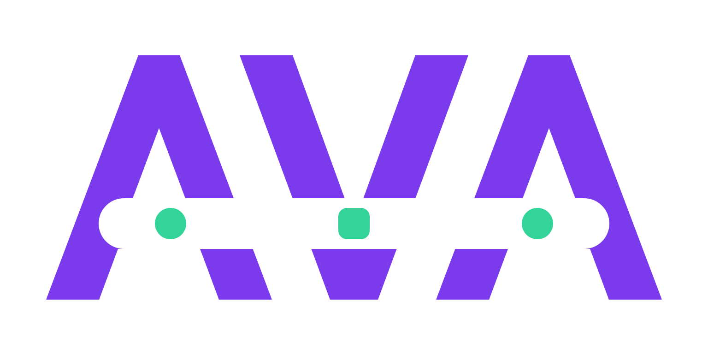

<p align="center">
  
</p>

<p align="center">
  <strong>A durable, replayable coding-agent harness for Python.</strong>
</p>

<p align="center">
  <a href="https://github.com/SmartAI/ava-python/actions/workflows/ci.yml"></a>
  
  <a href="LICENSE"></a>
  
</p>

## What is Ava?

Ava is a compact Python runtime for building and running coding agents. It combines a
provider-neutral agent loop, four bounded coding tools, a loopback Web UI, and an append-only
session log that makes every run resumable and inspectable.

The event stream is the source of truth. Model context, browser replay, queued input, compaction,
and crash recovery are all projections of the same durable history—there is no second conversation
store to drift out of sync.

Use Ava when you want a harness that is:

- **Easy to change:** a small, typed Python codebase with clear package boundaries.
- **Safe to resume:** acknowledged input and completed events survive interruption and restart.
- **Provider-neutral:** Anthropic, OpenAI-compatible endpoints, Codex, and a deterministic mock
  provider share one internal model.
- **Useful headlessly or interactively:** embed `Agent`, run a one-shot CLI task, or use the local
  Web UI.
- **Bounded by default:** HTTP bodies, SSE frames, session records, tool output, and decoded data
  have explicit limits.

> [!IMPORTANT]
> Ava is alpha software. Its Python API and on-disk session format may change before 1.0.

## Quick start

Requirements: Python 3.12 or newer and [uv](https://docs.astral.sh/uv/).

```sh
git clone https://github.com/SmartAI/ava-python.git
cd ava-python
uv sync

export ANTHROPIC_API_KEY=...
uv run ava --serve
```

Open `http://127.0.0.1:8777`, choose a project directory, and start a chat. To use an
OpenAI-compatible provider instead:

```sh
export OPENAI_API_KEY=...
uv run ava --serve --provider openai
```

Or reuse your existing Codex CLI login without copying an API key:

```sh
codex login
uv run ava --serve --provider codex
```

The Codex adapter reads `~/.codex/auth.json` once, read-only, and never touches the refresh token.

## Three ways to run

### Web UI

```sh
uv run ava --serve            # http://127.0.0.1:8777
uv run ava --serve 0          # choose an unused port and print the URL
```

The UI supports streamed responses, file and image attachments, project-scoped chats, steering,
queued follow-ups, pause/resume/abort controls, session metrics, provider settings, and light/dark
themes. It binds only to loopback and rejects mismatched `Host` and cross-origin `Origin` headers.

Codex reasoning summaries appear as collapsed disclosures beside the response.
Encrypted reasoning state remains model-only and never reaches the browser.

### One-shot CLI

```sh
uv run ava -p "explain src/ava/agent/turn.py"
uv run ava -c -p "now add a regression test"
uv run ava -p --session run.jsonl.zst "review this project"
uv run ava session dump run.jsonl.zst | jq .kind
```

### Python API

```python
from pathlib import Path

from ava.agent import Agent
from ava.llm import Item, Role, make_text_block, provider_from_environment


async with Agent.create(provider_from_environment(), Path.cwd()) as agent:
    with agent.subscribe(lambda event: print(event.seq, type(event.payload).__name__)):
        await agent.followup(
            Item(role=Role.user, blocks=[make_text_block("add a test for the parser")])
        )
        await agent.drive()
```

`Agent` is the public seam: applications submit input, control the driver, subscribe to durable
events, and inspect provider-neutral status without handling provider wire formats.

## How it fits together

```text
CLI / Web UI
     │
     ▼
   Agent ─────► read · write · edit · bash
     │
     ├────────► Anthropic · OpenAI-compatible · Codex · mock
     │
     ▼
append-only session events
     │
     ├────────► model context
     ├────────► UI replay
     ├────────► resume and recovery
     └────────► compaction and metrics
```

The implementation keeps a strict seam between the headless runtime and application surfaces:

```text
src/ava/
├── base/       errors, cancellation, home and project-root lookup
├── transport/  bounded HTTP client and incremental SSE parser
├── llm/        provider model, adapters, configuration, and credentials
├── session/    event vocabulary, JSONL/Zstandard log, recovery, and projections
├── proc/       process-group subprocesses with timeout escalation
├── tool/       read, write, edit, and bash
├── agent/      drive/turn/step loop, durable inbox, compaction, and prompt
└── app/        CLI and loopback FastAPI Web UI
```

Read [Architecture](docs/architecture.md) for the package contracts and invariants, or
[Port notes](docs/port-notes.md) for the deliberate differences from the original C++ Ava runtime.

## Durable by design

- Input is acknowledged only after its inbox event is durable, then claimed exactly once by a
  step.
- Session records are concatenated checksummed Zstandard frames. Recovery can replace an
  incomplete final frame, but never rewrites a complete event.
- Pause stops at a complete step boundary. Abort pairs partial tool calls with recorded
  `interrupted` or `skipped` results so replay remains valid.
- Provider failures are contained at the drive boundary and pending input stays available.
- The browser consumes the replay-first event stream instead of maintaining its own transcript.

## Configuration

Settings live in `$AVA_HOME/settings.json` (default: `~/.ava`). Credentials come from the
provider's environment variable or `$AVA_HOME/auth.json`. Selection precedence is:

1. CLI flags
2. Resumed session
3. `AVA_PROVIDER`, `AVA_MODEL`, and `AVA_EFFORT`
4. Settings file
5. Built-in defaults

Any endpoint that speaks the Anthropic or OpenAI API family can be registered in the settings
file:

```json
{
  "provider": "my-gateway",
  "model": "company-model",
  "providers": {
    "my-gateway": {
      "family": "openai",
      "base_url": "https://gateway.internal/v1",
      "api_key_env": "GATEWAY_KEY",
      "models": {
        "company-model": {
          "context_window": 128000,
          "effort_values": ["low", "high"]
        }
      }
    }
  }
}
```

For offline development, `AVA_PROVIDER=mock AVA_MOCK_SCRIPT=script.txt` selects the deterministic
scripted provider. It exercises the full loop and Web UI without a network connection or API key.

## Develop

```sh
uv run pytest
uv run ruff check src tests
uv run mypy src
npm ci
npm run check
```

When the React source in `src/ava/app/web/frontend/` changes, rebuild the checked-in browser bundle
with `npm run build`.

The acceptance suite focuses on observable invariants: durable input is never lost or duplicated;
tool calls remain paired after abort and recovery; torn tails recover idempotently; pause/resume
preserves valid model history; and provider failures do not discard pending work.

## Scope

Ava intentionally has no TUI or voice frontend. It also does not currently include MCP,
permission prompts, plugins, subagents, or parallel tool dispatch. Session logs are as sensitive as
the repositories they record and are never scrubbed.

## License

[MIT](LICENSE) © 2026 Min Liu.
