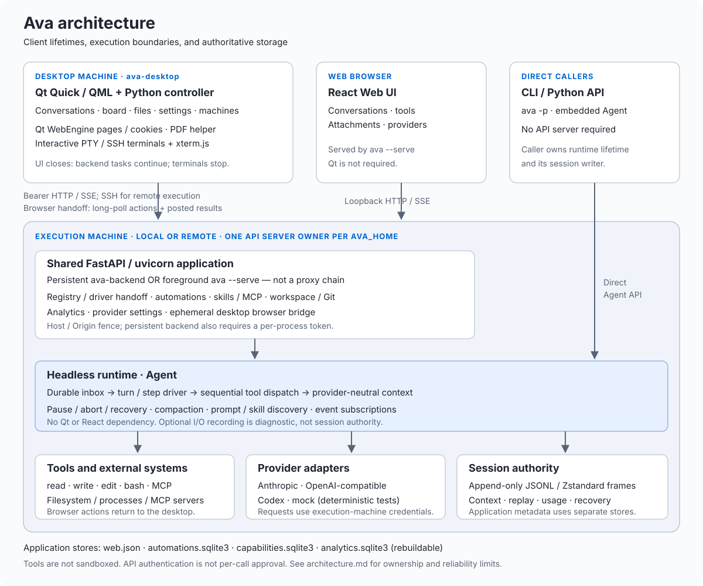

# Architecture

Ava has a headless Python runtime, a Qt Quick desktop workbench, a React Web UI,
and a CLI. Python applications can embed the runtime directly. The desktop is a
client of a persistent backend, not the owner of the agent loop.

The diagram shows runtime and deployment relationships, not a complete Python import graph.

## Applications and process boundaries

| Entry point | Execution and lifetime |
| --- | --- |
| `ava-desktop` | PySide6/QML UI with Qt networking. Starts or reconnects to a local backend; can connect to remote backends over SSH. Closing the UI does not stop backend tasks. |
| `ava-backend` | Persistent FastAPI/uvicorn process. Owns projects, agents, scheduling, MCP connections, and analytics. Starts detached on demand or through launchd/systemd. |
| `ava --serve` (also bare `ava`) | Foreground loopback server serving the React bundle and the same API implementation. It owns its agents; it is not a proxy to an existing backend. |
| `ava -p` / Python API | Runs `Agent` directly, without an HTTP server or Qt. Lifetime belongs to the caller. |

`app/web/server.py:create_app` composes the shared API, registry, scheduler, and
analytics. The `web` package name does not mean these facilities are browser-only.
`app/desktop/controller.py` coordinates desktop state; `connection.py` sends HTTP
commands and consumes SSE. Durable event replay and live status updates are distinct:
conversation history comes from session events, while status and catalog/summary
refreshes describe current process state.

Only one API server may own an `AVA_HOME`. The standalone Web server and persistent
backend cannot use that home concurrently. The desktop also has a per-home instance
lock. An independent CLI must not resume a session already owned by a backend.

### Remote machines and desktop-owned resources

`app/remote.py` and `app/desktop/ssh.py` bootstrap a matching backend package and an
SSH tunnel after host-key verification. Each execution machine owns its providers,
credentials, projects, session logs, schedules, and MCP processes. The desktop
aggregates machine summaries; it does not copy remote session storage locally.
Compatible reconnects verify machine/process identity and do not resend prompts.
Updates wait for active work rather than canceling it.

Files and Git operations run on the selected machine. Remote previews use bounded,
version-checked temporary downloads. Interactive terminals are desktop-owned PTY/SSH
sessions rendered with bundled xterm.js; they are separate from the agent's `bash`
tool and stop when the desktop closes. PDF rasterization runs in a helper process
(`desktop/_pdf_worker.py`) so Qt's PDF lock does not stall the conversation UI.

Qt WebEngine pages, cookies, and browser import stay on the desktop. A session-scoped
handoff exposes a browser tool in the backend. The desktop long-polls for actions,
executes them against the visible tab, and posts results; this also works over the
remote tunnel. Revocation, expiry, and disconnect end the handoff. Timed-out actions
may already have taken effect and are not automatically retried.

## Code responsibilities

| Package | Responsibility |
| --- | --- |
| `app` | Entry points, HTTP API, registry, persistence of application metadata, desktop/Web presentation, and machine orchestration. |
| `agent` | Public agent API, inbox/driver lifecycle, prompt and skill discovery, tool dispatch, compaction, and diagnostic recording. |
| `session` | Provider-neutral event schema, compressed log, writer, context reconstruction, inspection, and recovery. |
| `llm` | Provider-neutral items/events plus Anthropic, OpenAI-compatible, Codex, and mock adapters; configuration and credentials. |
| `tool` | Tool contracts and read/write/edit/bash implementations; MCP connections and result adaptation. |
| `transport` / `proc` / `base` | HTTP/SSE, subprocess execution, cancellation, errors, home paths, and image limits. |

The core does not import Qt, React, or application routes. `agent` uses `session`,
`llm`, and `tool`; session context uses neutral LLM types. Provider adapters use
transport, and shell tools use process helpers. This is not a strict linear stack.

## Public seam

`Agent` is the primary application boundary. Applications submit input, control the driver,
subscribe to durable events, and read provider-neutral status or context reports through it.

The boundary is not yet fully encapsulated: `app/web/registry.py` assigns shared MCP ownership
through `Agent.state`; `routes.py` reads session state and updates provider model overrides;
`browser.py` attaches browser tools through it. These are existing coupling points, not a
recommended extension API. Embedders should use the public methods and explicit tool/prompt
arguments. Moving these application accesses behind public methods remains architectural work.

An agent owns its provider, durable writer, and scratchpad. Call `await agent.aclose()` when done,
or use `async with`. The Web registry closes every chat agent during the FastAPI lifespan shutdown.

## Durable input seam

Acknowledging input, claiming input for a step, and deciding a turn boundary are serialized by one
inbox gate. `followup()` and `steer()` return only after their inbox splice is durable. A step claims
one next-turn message on its first step and all available next-step messages. The gate remains held
from the driver's snapshot through that claim so an acknowledged message cannot be lost between
the two operations.

## Driver lifecycle

The driver moves through `idle`, `running`, `pausing`, `paused`, and `aborting`. A turn contains one
or more provider steps; a step either ends the turn or emits tool calls whose paired results become
the next step's context. Pause is honored at a complete step boundary. Abort repairs partial model
and tool output before it closes the turn.

Only one driver may own an agent. The Web `DriveHandoff` compensates for a message acknowledged as
the owning driver finishes, without starting a second driver.

The Codex adapter accepts multiple function calls in one response. It buffers arguments by item
ID, then emits complete calls to the core in their original order. Parameter completion order does
not determine tool execution order; the driver still dispatches tools sequentially. A malformed or
incomplete response does not execute its calls or commit unmatched calls to the next request.
Terminal usage remains billable even when the response fails. Buffering moves the tool-only first
content timestamp to a completed call, so that timestamp is not directly comparable to a provider
that emits its tool-start event immediately.

## Editing and progress feedback

The model-facing `edit` contract uses `path` and an `edits` array of `oldText` /
`newText` pairs. Each exact match is located in the original file. Missing,
ambiguous, or overlapping matches reject the entire batch before writing.
Successful replacements preserve untouched bytes and are written once. This
prevalidation does not promise filesystem rollback after an I/O failure.
Legacy `old_string`, `new_string`, and `replace_all` arguments remain accepted
for existing callers; new model requests receive the batch schema.

The default prompt does not require narration before tool calls. The browser
derives activity labels from tool events; final outcomes, errors, and blockers
still have to be reported faithfully.

## Session authority

The append-only session event stream is the authority for model context, browser replay, pending
inbox state, and crash recovery. Physical writes are bounded frames; subscribers see durable events
only after their bytes reach the kernel. Recovery may repair a torn final frame and append missing
`interrupted` lifecycle closers, but never rewrites a complete logical event.

The JSONL codec is intentionally explicit. Its event-by-event mapping is compatibility and
validation code, not generic object serialization, and unknown future event kinds are preserved.

## Storage authority

The session stream is authoritative for conversations, not for every application feature.
Paths below are relative to the execution machine's `AVA_HOME` (default `~/.ava`),
except desktop-owned state, which lives on the desktop machine.

| Store | Authority / lifetime |
| --- | --- |
| `sessions/` (`*.jsonl.zst`) | Conversation events, queued input, model selection, usage, and recovery. CLI callers can choose an explicit log path. |
| `web.json` | Project registration and conversation navigation metadata, including pins, archives, and review markers. |
| `automations.sqlite3` | Schedules and execution bookkeeping; each run has its own conversation log. |
| `capabilities.sqlite3` | Skill availability and MCP server configuration, including configured secrets and OAuth tokens/client registrations. Owner-only permissions, not encrypted at rest. Skill instruction files remain in their discovery locations. |
| `analytics.sqlite3` | Rebuildable incremental index derived from session history, not a second conversation authority. |
| `settings.json` / `auth.json` | Provider configuration and saved credentials. Environment credentials can take precedence. Codex uses its separate file-based login. |
| `machine.json` / `backend.json` | Durable machine identity / private current-process endpoint and bearer token. |
| `desktop.ini` / `browser/` | Desktop preferences and machine navigation / local browser profile and imported data. |
| `worktrees/` | Actual Git checkouts; archiving a conversation does not delete them. |

MCP OAuth uses the SDK's `OAuthClientProvider`, with one auth instance/refresh lock per
server shared across workspace connections. The backend persists absolute token expiry and
validated authorization/resource metadata alongside the tokens so refresh survives restarts.
Config binding and a credential generation fence prevent stale callbacks or in-flight refreshes
from restoring credentials after removal or sign-out. Interactive login is a separate,
time-bounded task, not a blocked agent request. A desktop-only loopback listener forwards the
code/state/issuer through the existing authenticated connection to the originating backend;
SSH machines need no public callback endpoint. OAuth URLs/codes/tokens are not conversation events.

Backend shutdown stops scheduling, cancels pending OAuth logins, closes agents and shared MCP connections, then releases
ownership. A crash leaves logs recoverable but does not automatically rerun interrupted tools
or unconfirmed automation executions. Schedules require an awake machine and running backend.
See [usage](usage.md#automations) for missed-run and restart policies.

## Session diagnostics and task evaluation

`ava session inspect` derives a read-only report from the event log. It does not
repair files or infer task correctness from a completed turn.

`eval.diagnose` uses the same session authority to locate repeated tool arguments,
error results and truncation clues. It reports evidence coordinates and character
counts rather than inventing token measurements or declaring repeats wasteful.

`eval.benchmark` freezes tasks, candidate wheels, adapter code and configuration,
then runs fresh Harbor environments. Models see new tool observations and may take
different trajectories. Independent deliverable grades are separate from process
completion, resource measurements and infrastructure failures. Comparisons require
complete compatible samples and verify recorded candidate identity.

`eval.evolve` is a bounded prompt-search experiment. Ava receives selected development
sessions and only evidence-reading/proposal tools. A candidate changes the baseline
wheel's prompt and RECORD; it cannot change graders or accept itself. Candidate
selection requires new task trials, with independent validation data supplied by
the experiment owner. This is not model-weight training or an RL implementation.

An opt-in one-shot recording captures provider streams and tool responses for
offline replay. It is a diagnostic artifact, not another live conversation store:
normal operation and recovery still use only the session log. Replay constructs
the same `Agent` with recorded tools and a recorded initial prompt, checks each
request, and refuses missing exchanges or a changed terminal outcome. No live
provider or real tool is instantiated during replay.

`Agent.create` and `Agent.create_at` accept explicit `tools` and `system_prompt`
overrides for embedding and replay. The default coding tools and prompt are
unchanged when these arguments are omitted. Evaluation tooling stays under
`eval/`; its heavy benchmark dependencies are excluded from the Ava wheel.

See [Evaluation and iteration](../eval/README.md) for datasets, upstream graders,
measurement definitions, and reproducibility limits.

## Evaluation gates

Every architectural change must keep these gates green:

- durable input is acknowledged and claimed exactly once;
- every persisted model tool call has one result after completion, abort, or recovery;
- pause/resume and provider failure leave replayable history;
- `ruff`, `mypy`, the Python 3.12 test suite, and the frontend build pass;
- application changes do not add new direct `agent.state` coupling; existing exceptions are listed above;
- provider clients close on agent replacement and shutdown.

## Reliability and trust boundaries

The session event stream is the source of truth for conversation state, queued input,
and recovery. The optional I/O recording is a diagnostic artifact for offline replay.

- **Recoverable sessions:** checksummed Zstandard frames preserve complete events;
  recovery can replace an incomplete final frame.
- **Explicit interruption behavior:** pause stops at a complete step boundary; abort
  pairs partial tool calls with `interrupted` or `skipped` results. Provider failures
  are contained at the drive boundary and pending input remains available.
- **Bounded resources:** HTTP bodies, SSE frames, session records, tool output, and
  decoded data have explicit limits; subprocesses have timeout escalation.
- **Shared event history:** the browser consumes persisted events instead of keeping
  a separate conversation store. The server binds to loopback and validates `Host`
  and `Origin` headers.

Input acknowledgement follows a write to the kernel; `fsync` occurs at separate turn
boundaries. These are process-recovery guarantees, not exactly-once external command
execution or a promise that every acknowledged input survives power loss.

The persistent backend additionally requires a per-process bearer token. Standalone
`ava --serve` uses the loopback Host/Origin fence without that token; neither mode is
intended as an internet-facing multi-user service. SSH supplies the remote transport.
These controls protect API access, not tool execution: file, shell, and MCP tools
run with the execution user's permissions, without a sandbox or per-call approval.
Browser handoff is a separate explicit grant, not a general approval mechanism.
Provider requests may transmit workspace content externally.

See [permissions and privacy](features.md#permissions-and-privacy),
[desktop design system](desktop-design-system.md), and [usage](usage.md) for
user-facing behavior and operational commands.
