# Feature guide

[Quick start](../README.md#quick-start) · [Usage and configuration](usage.md) ·
[Architecture](architecture.md)

Ava works with a folder and a goal. A workspace can contain research, notes, data,
or software; Git is optional. The screenshots below show the current interfaces
with isolated demo data and a scripted local model, not a model-performance test.
Click an image to inspect it at full resolution.

- [Research and writing](#research-and-writing) · [Data analysis](#data-analysis)
- [Desktop workbench](#desktop-workbench) · [Browser handoff](#browser-handoff)
- [Skills and MCP](#skills-and-mcp) · [Automations](#automations-and-background-work)
- [Sessions and remote machines](#sessions-and-remote-machines)
- [Session board and analytics](#session-board-and-analytics)
- [Git and terminals](#git-and-terminals) · [Models and providers](#models-and-providers)
- [Context and activity](#context-and-activity) · [Interfaces](#interfaces)
- [Permissions and privacy](#permissions-and-privacy)

## Research and writing

Bring source material into a workspace, ask Ava to compare or summarize it, and
review the resulting document beside the conversation. Local files, a shared
browser tab, and connected research tools can supply context. Skills can provide
repeatable instructions for sourcing, structure, and review.

| Task | Example request |
| --- | --- |
| Research and compare | “Compare these suppliers and write a brief with sources and open questions.” |
| Write and organize | “Turn these meeting notes into a project proposal and an action list.” |

These are workflows you can ask for, not built-in specialist services or
performance guarantees. Results depend on the model, source material, tools, and
permissions. Check sources and review important conclusions.

## Data analysis

Ava can read datasets, run shell commands and scripts, and write reports or
transformed files using programs installed on the execution machine.

For example: “Check these CSV exports for inconsistencies and save a summary of
the trends.” In this tour, the agent reads research notes and a feedback CSV,
runs a Python summary, and writes a Markdown brief.

Document conversion and specialized analysis may require additional programs.
Web access comes through the desktop browser or tools you configure.

## Desktop workbench

The native desktop keeps conversations, files, browser tabs, and interactive
terminals in one workspace. Sidebars resize, previews stay open in tabs, and the
same project can hold multiple conversations.

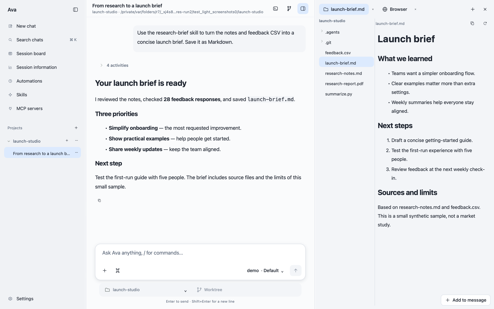

### Files, images, and PDFs

Drag in text files, paste images, or attach them from the composer. Type `/` to
find commands and discovered skills. Drafts and staged attachments stay with
their conversation while the desktop is open.

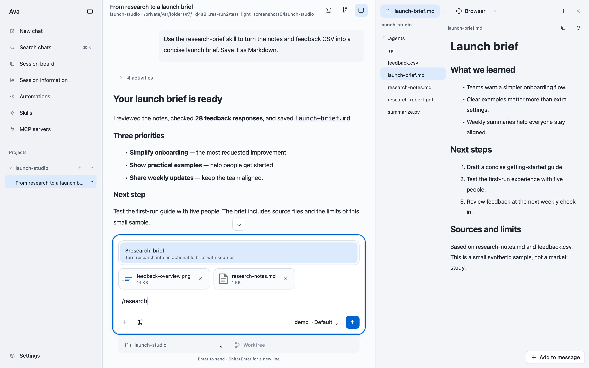

Browse local or remote files and preview source, Markdown, images, and PDFs.

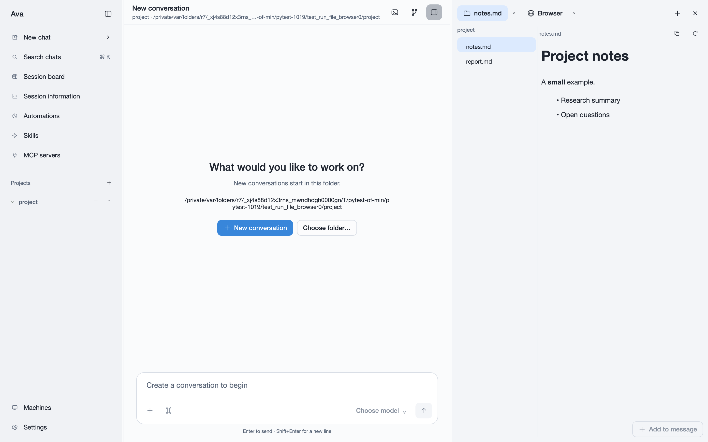

PDF previews support page navigation, zoom, selectable text, internal links, and
password-protected documents. Pages render on demand in a helper process, separate
from the conversation UI. Previewing a PDF is separate from attaching one: direct
PDF message attachments are not supported.

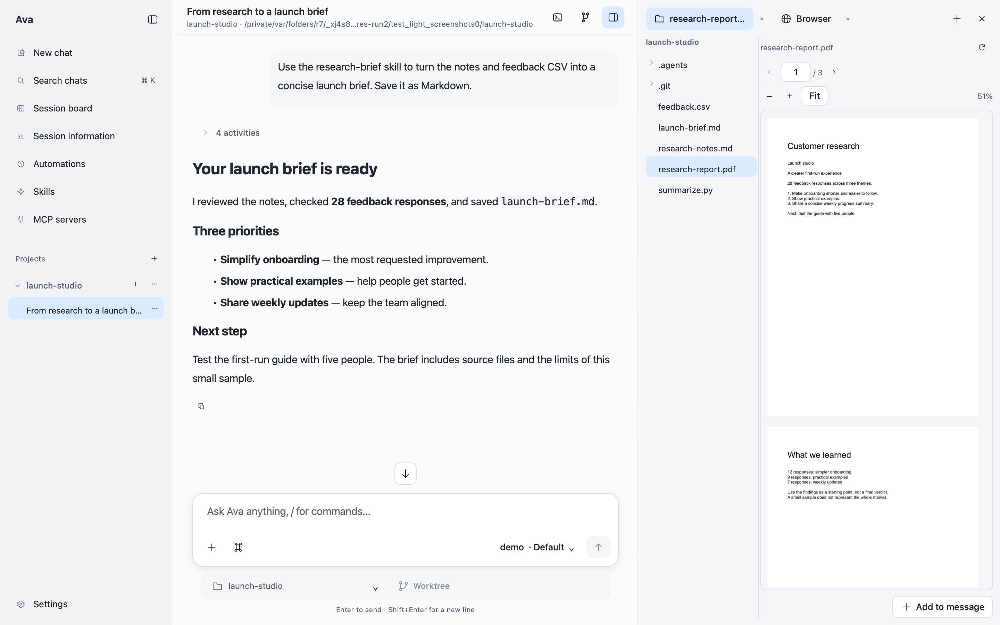

### Appearance

Choose light or dark mode, adjust conversation text size, resize the workspace,
and enable reduced motion. Keyboard shortcuts are listed in Settings.

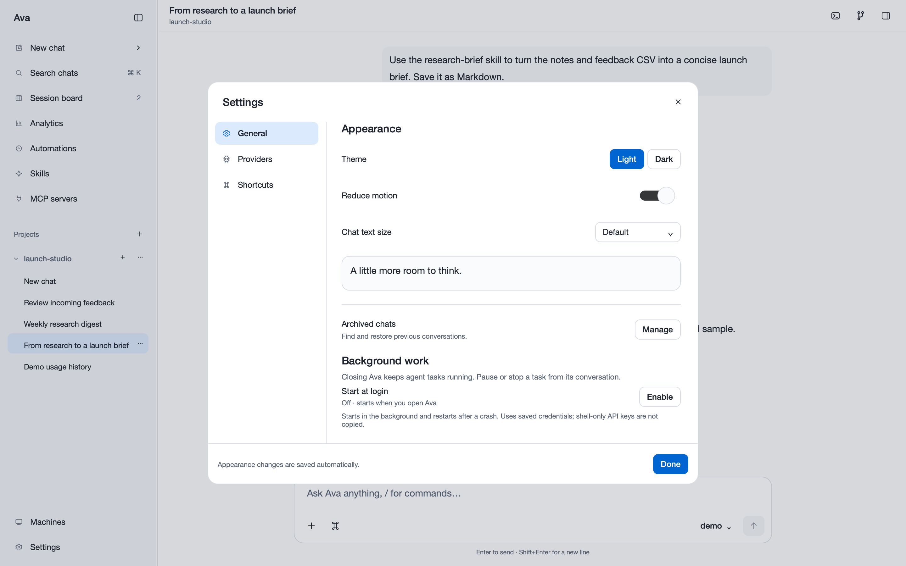

[Desktop setup and controls](usage.md#qt-quick-desktop-app) ·
[Design system](desktop-design-system.md)

## Browser handoff

The embedded desktop browser keeps page review in a right-side tab, with the
address bar, navigation, and bookmarks available without leaving the workspace.

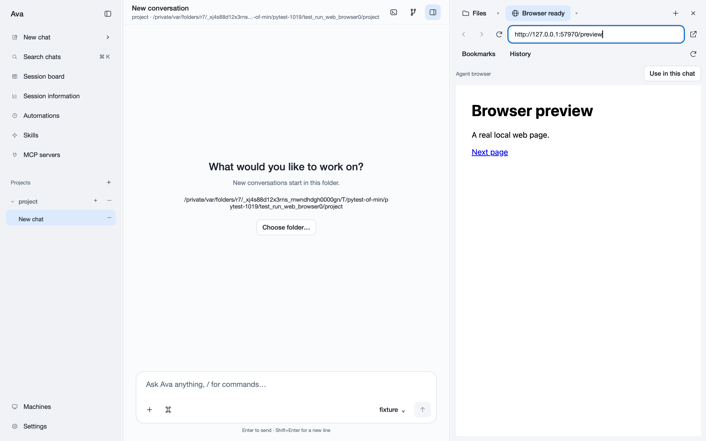

Open a page and choose **Use in this chat** to let Ava inspect and operate that
visible tab. Browser tools support navigation, clicks, form filling, scrolling,
and screenshots. Choose **Take control**, or interact with the page yourself,
to end the handoff.

For example: “Read this page and fill in the draft form. Leave submission to me.”
The screenshot shows a draft filled through real browser tools, without submitting
it. The desktop must remain open and the shared tab visible.

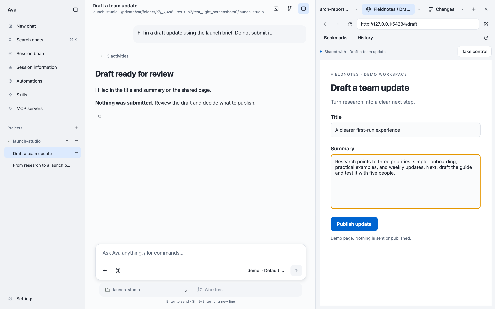

## Skills and MCP

### Skills

Discover, search, preview, create, enable, and disable reusable instructions.
Project skills live in `.agents/skills`, personal skills in `$AVA_HOME/skills`,
and shared skills in `~/.codex/skills`. Insert a skill from the `/` menu or choose
**Use in chat** from its detail view.

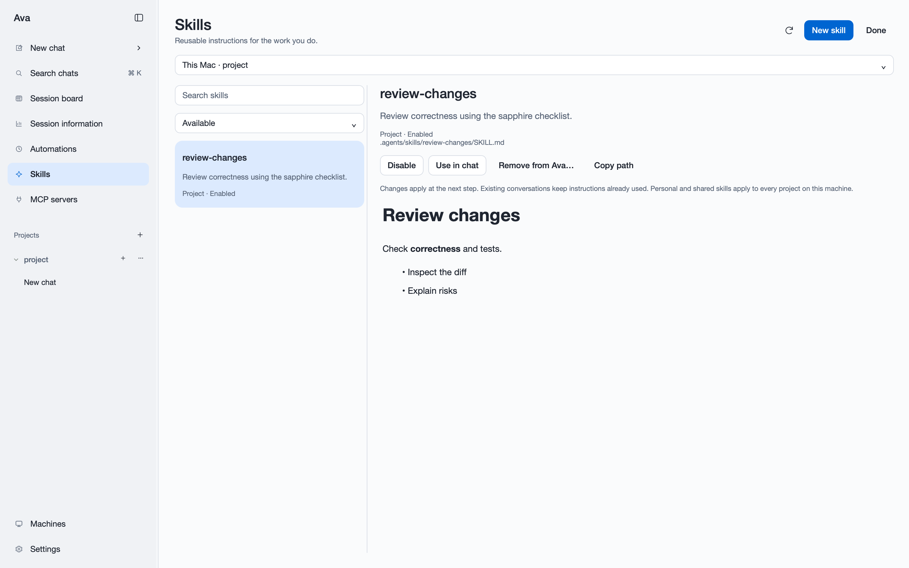

### MCP tools

Connect local stdio servers or remote Streamable HTTP endpoints on the selected
machine. Browse tools and their parameter schemas, refresh catalogs, inspect
connection errors, and enable or disable a server.

Results can include text, structured data, and images. Integrations depend on the
servers you install or connect; interactive MCP OAuth login is not yet supported.

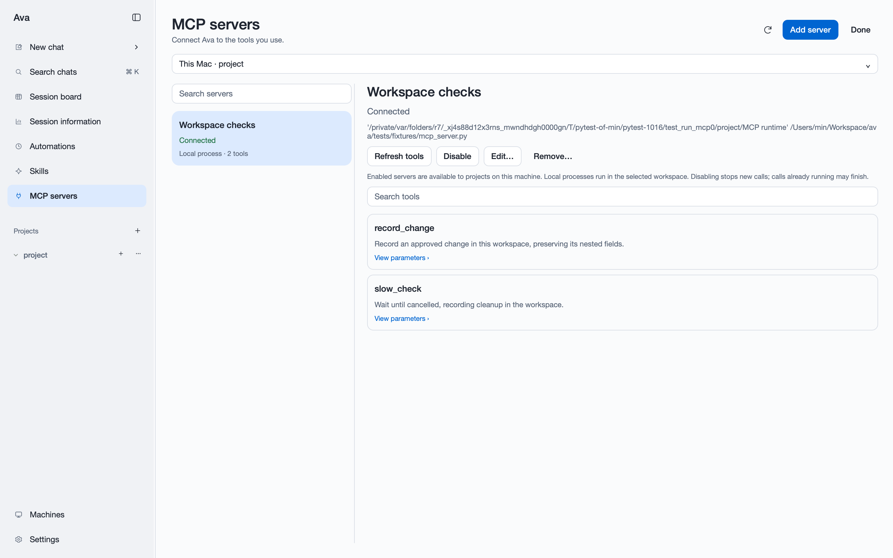

## Automations and background work

Schedule a prompt once or on a repeating cadence, with a timezone, run count,
machine, project, and optional model settings. Git projects can use a fresh
worktree per run.

For example: “Every Monday, summarize the new reports in this folder.”

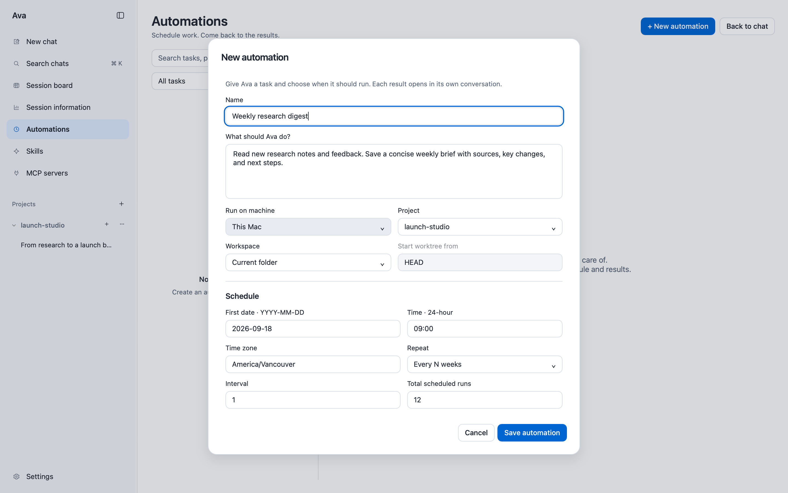

Preview upcoming runs, pause schedules, start an extra execution, and open each
result as its own conversation. Manual runs do not consume scheduled repetitions.

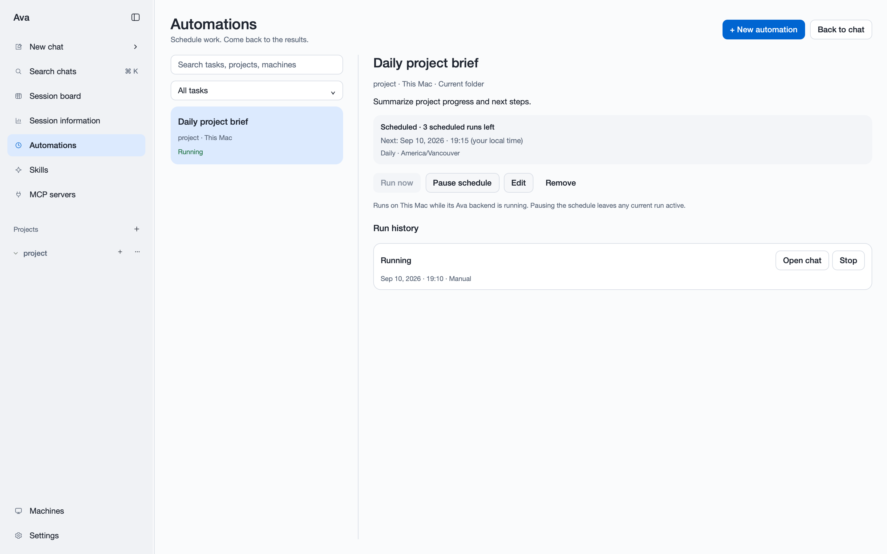

Desktop agent tasks can continue after the window closes because the backend is
persistent. Reopen Ava to reconnect. Optional start-at-login support uses launchd
on macOS or a systemd user service on Linux.

Background work requires an awake execution machine and a running backend. A
crash does not automatically retry interrupted tasks. Browser handoffs and desktop
terminal shells do **not** continue after the desktop closes.

[Scheduling, missed runs, and lifecycle details](usage.md#automations)

## Sessions and remote machines

### Durable sessions

Messages, tool calls, and results live in append-only, checksummed, compressed
logs. Pause at a step boundary, steer a running task, queue a follow-up, or resume
later. Recovery preserves valid history rather than silently starting over;
CLI inspection exposes the underlying events.

### Conversation organization

Search across projects, pin important chats, rename conversations, and archive or
restore them. Projects need not be Git repositories, and switching conversations
also switches to the appropriate workspace.

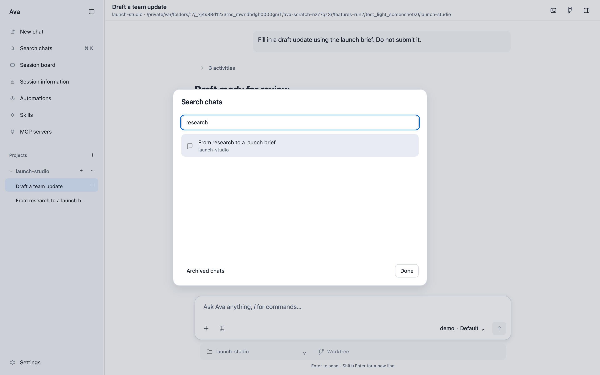

### SSH machines

Connect an SSH alias or `user@hostname` from **Machines**. Keep projects and agent
execution on the selected machine while using one desktop to browse files, open
terminals, manage skills and MCP servers, schedule work, and review results.

New hosts require fingerprint verification before Ava installs its backend in the
remote user directory. Connections use an authenticated loopback service through
SSH. Remote sessions and provider credentials stay on the remote machine; browser
pages and cookies stay on the desktop.

The form below shows how to add a machine; `research-host` is an example SSH alias.

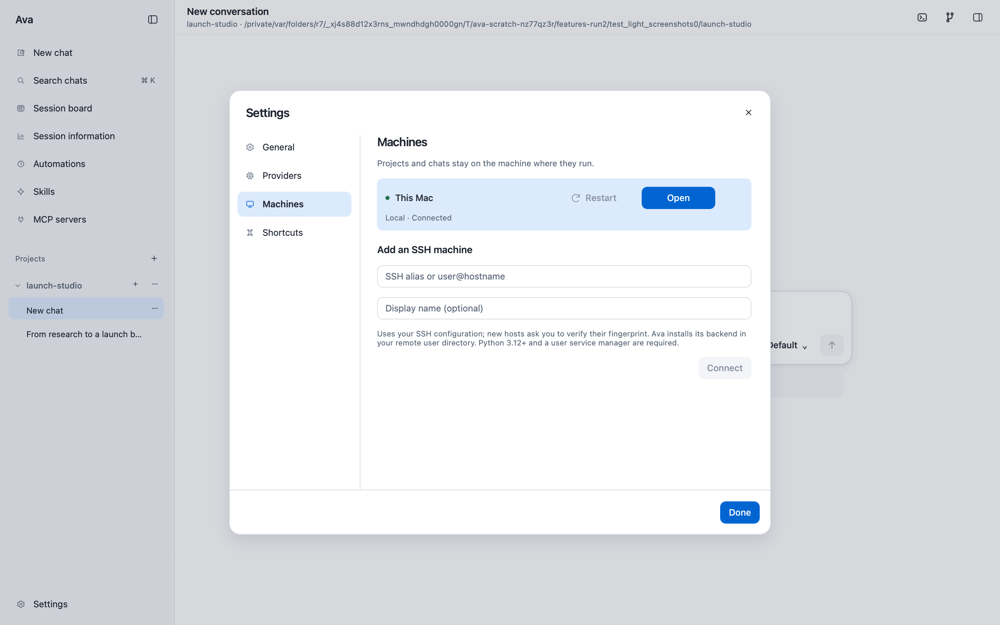

[Remote setup, requirements, and lifecycle details](usage.md#qt-quick-desktop-app)

## Session board and analytics

### Session board

Review work across projects and machines in **In progress**, **Needs review**, and
**Reviewed** columns. Filter results and mark them reviewed. Seeing a result in
its conversation also marks it reviewed; a later result needs attention again.

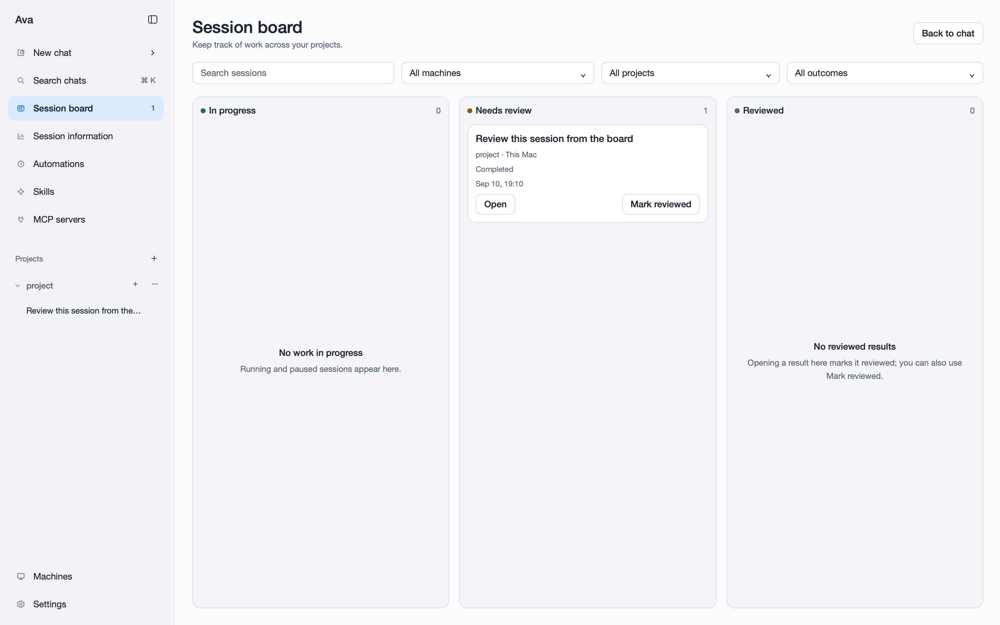

### Analytics (session information)

Open **Analytics** to explore 7-day and 30-day trends for tokens, active agent time, tools, and observed
skill loads, filtered by machine or project. Missing usage is identified rather
than guessed. These are usage metrics, not a billing dashboard or a measurement
of task correctness; the chart below uses sample history.

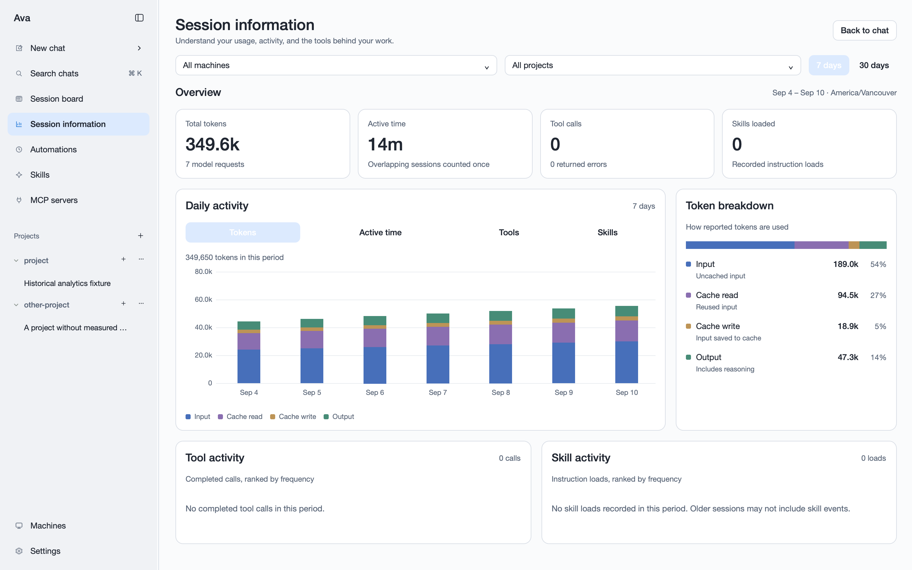

## Git and terminals

Ava can read and edit code, run tests, and work in isolated Git worktrees.
For example: “Fix this bug, add regression tests, and explain the diff.”

### Interactive terminals

Open interactive shells alongside the conversation. Tabs keep multiple terminal
sessions available without leaving the desktop.

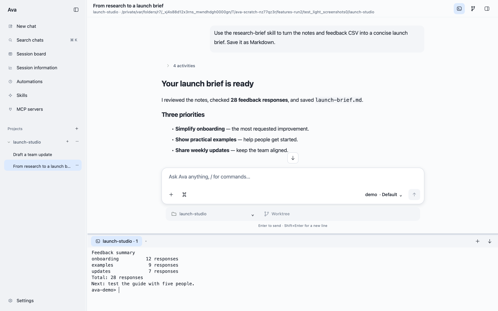

### Change review

The **Changes** view shows working-tree and staged diffs. Stage, unstage, and
commit without leaving the desktop. Git hooks still run; failed commits preserve
the message and staged files for correction.

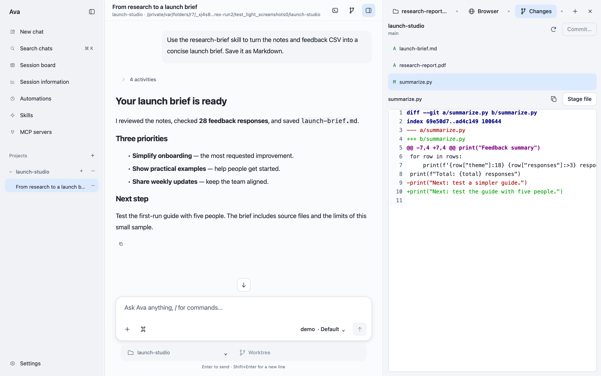

### Worktrees

Start a conversation on a new branch in a separate folder. Uncommitted changes
stay in the original workspace, and chats remain grouped under the same project.

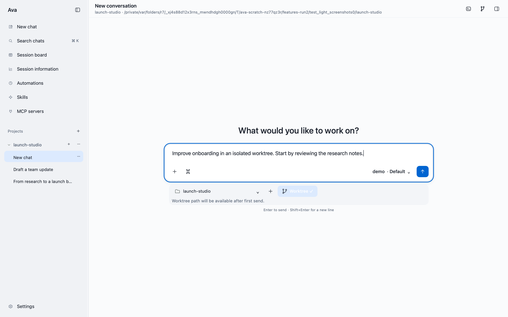

## Models and providers

Use Anthropic, OpenAI, DeepSeek, an existing Codex CLI login, or a custom
OpenAI-compatible or Anthropic-compatible endpoint. Configure connections in
**Settings → Providers**; credentials are separate from conversation selections.

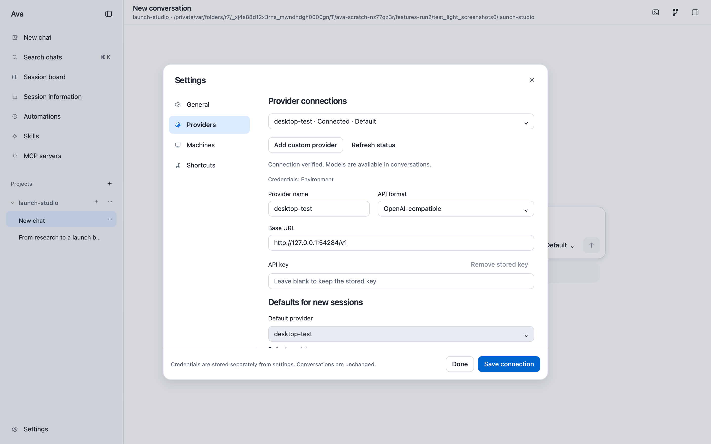

Choose a provider, model, and supported reasoning effort per conversation without
changing other conversations. The screenshots use a scripted `demo` provider.

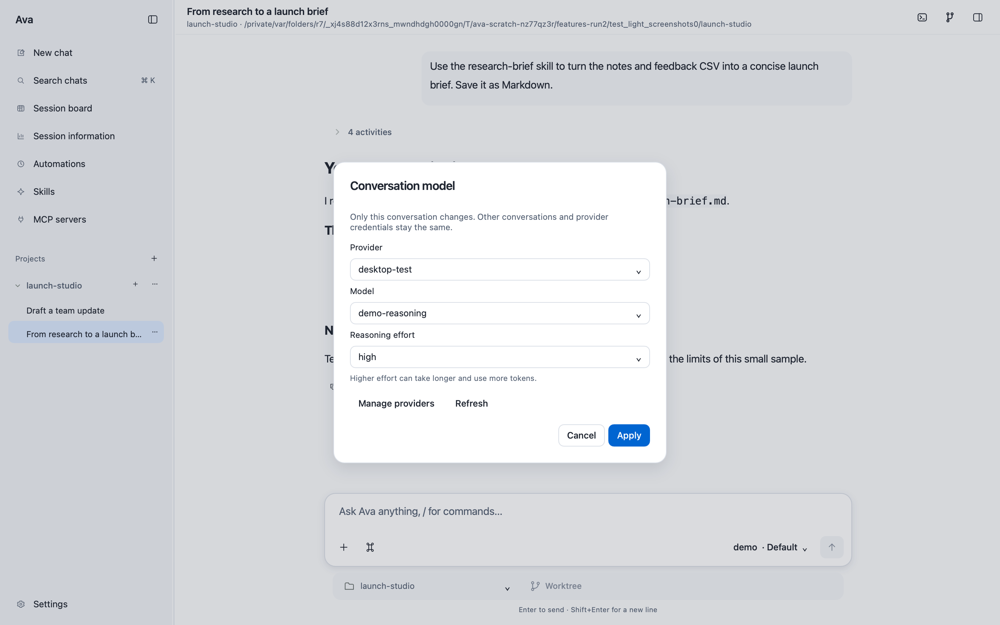

[Provider configuration](usage.md#configuration)

## Context and activity

Expand grouped tool calls and reasoning activity to inspect output. `/context`
shows estimated model-window usage and its main contributors. Automatic
compaction helps long-running conversations fit their context budget.

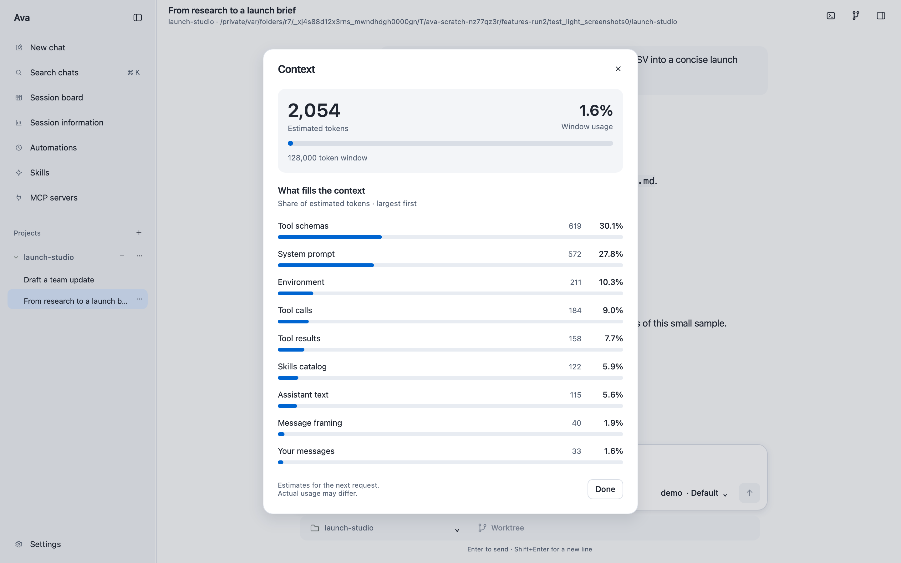

## Interfaces

| Interface | Best for |
| --- | --- |
| **Desktop** | The full workbench: browser handoff, files, terminals, skills, MCP, automations, analytics, and SSH machines. |
| **Web UI** | Local browser-based conversations, streaming tool activity, attachments, and provider configuration. |
| **CLI** | One-shot tasks, scripts, explicit session paths, resume, inspection, and diagnostic replay. |
| **Python API** | Embedding the runtime with custom tools, a custom system prompt, and durable event subscriptions. |

### Web UI

Start the local browser interface with `uv run ava --serve`. It uses the same
runtime and durable sessions; Qt is optional. Attach files and images, send a task,
and review the response and tool activity.

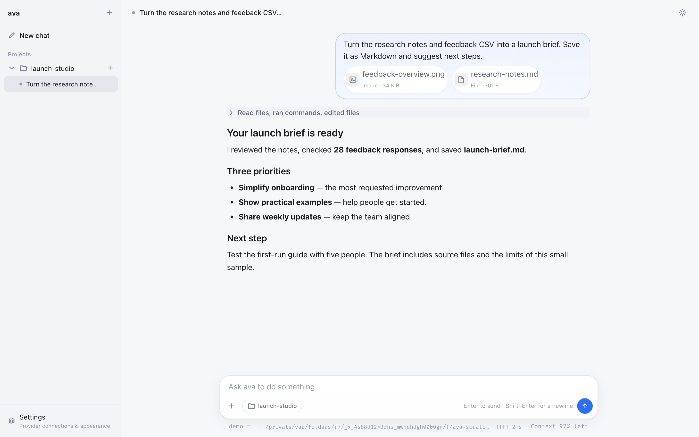

Expand the activity group to inspect source reads, commands, writes, and their
results.

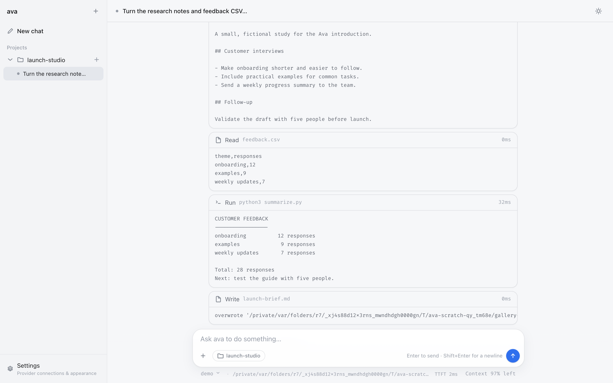

Model and reasoning-effort choices belong to each conversation.

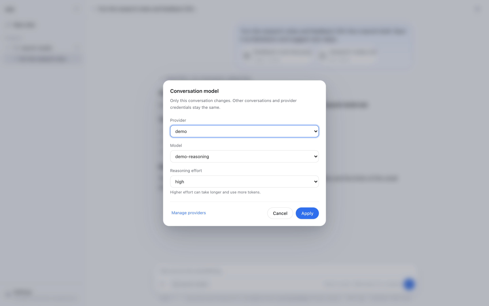

Manage provider connections separately from those conversation choices.

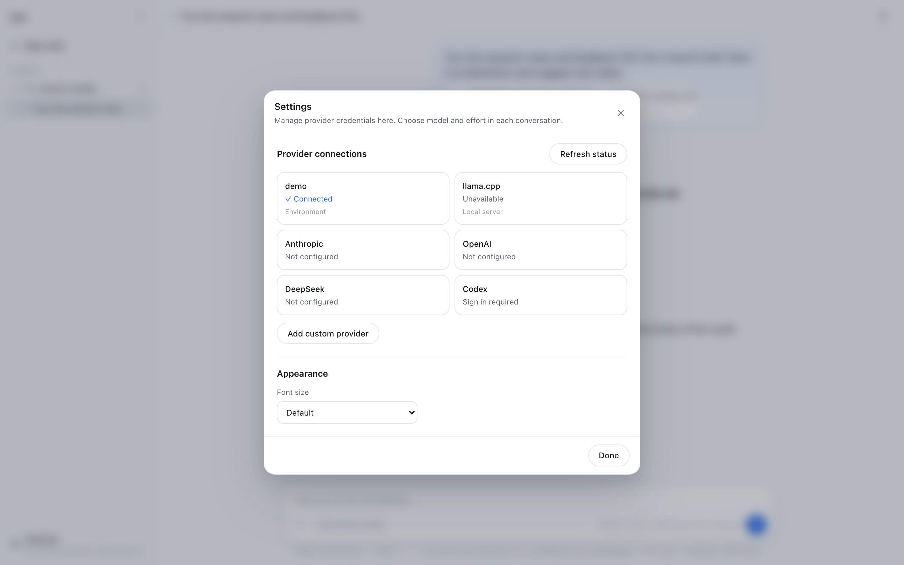

### CLI and Python

From the cloned repository, install the core with `uv sync` and configure your
provider credentials. For the default Anthropic provider, you can set
`ANTHROPIC_API_KEY`; an existing Codex CLI login can be used with `--provider codex`.
Desktop installers are not yet included.

```sh
# Open the local Web UI.
uv run ava --serve

# Run a task, then continue the same session.
uv run ava -p "Summarize the Markdown documents in this folder"
uv run ava -c -p "Turn that summary into an onboarding guide in onboarding.md"

# Name and inspect a session explicitly.
uv run ava -p --session research.jsonl.zst "Compare the documents in this folder"
uv run ava session inspect research.jsonl.zst
uv run ava session dump research.jsonl.zst
```

[CLI reference](usage.md#cli) · [Python API](usage.md#python-api) ·
[Try without an API key](usage.md#try-it-without-an-api-key)

## Permissions and privacy

Ava is **alpha software**. File and shell tools run with the execution user's
permissions, **without per-call approval or a sandbox**. Browser handoff is
explicit, but it is not a general approval system. Review the tools and MCP
servers you enable, use an appropriately restricted account or environment, and
review important outputs and consequential actions.

Workspace history stays on the execution machine, but content needed for model
requests is sent to your selected provider; connected tools may use external
services. Session logs can contain sensitive material. “Local” describes the
application and storage, not an offline-model guarantee.

The published evaluation currently measures coding tasks, not research, writing,
browser work, or general-purpose task quality.
[Benchmark results and limitations](benchmark.md).
